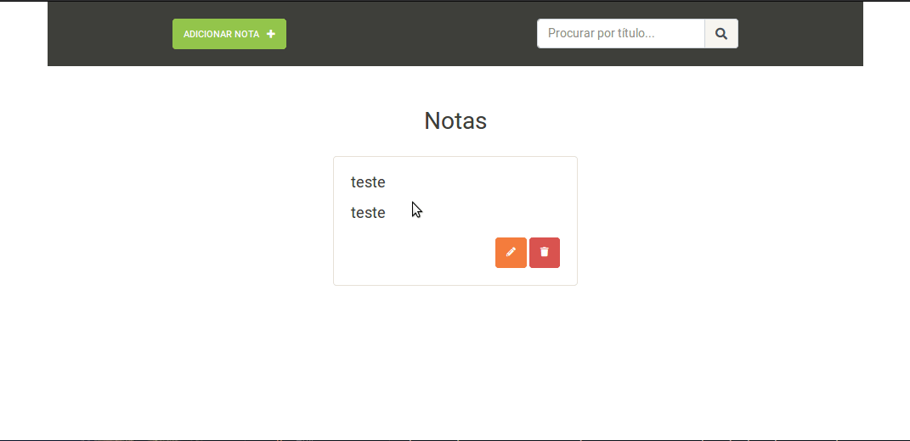

# notepad com Laravel 5.4
Projeto simples para servir de base para estudo das funcionalidades do laravel 

#### Assuntos estudados
- instalação com composer
- Migrations
- Models
- controllers
- Rotas
- comandos do artisan (make, serve, tinker)
- Blade

#### Todo
- autenticação 
- Servir a aplicação em formato de Api REST

##### instalação
- Clone o repositório
- Use o comando `composer install` para instalar as dependências
- Crie um Banco de dados no mysql
- Modifique o arquivo `.env.example` com as configs do Banco de dados, inclusive o nome do BD criado e mude o nome do arquivo para `.env`
- Rode as migrations com o comando `php artisan migrate`
- Sirva a aplicação com o comando `php artisan serve`

#### Demonstração
